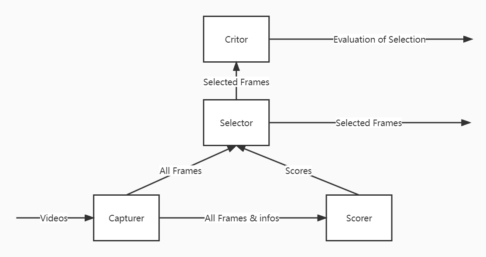

# Frame Selection Strategy

## Description
This project is for selecting frame of all kinds of videos based on multiple frame scoring policy. Aims at accerlating the pre-processing step of Computer Vision works, we integrated different frame selection policies and developed this flexible and fast frame selection lab.

### Purpose
+ Developed a useful tool for extracting frame from videos in a flexible way.
+ An extensible architecture following Registry Mode for further development.
+ Visuable exhibition of the selection result.

### Project Architecture
+ registry: contain source code for registries and their configs
+ score
+ strategy

### Development Plan
- [x] Develop evaluation methods for each strategy
- [ ] Develop API and API document
- [ ] Develop OOD-based scores and strategy


## Using Guidance
### Quick Run

1.  Clone the specific branchs with
```
# bash
git clone https://github.com/JasonZuu/Frame-Selection.git
```
1. import the abstact class.
```
# python
from frame_selection import FrameSelectionAbstract
```
3. Call functions of FrameSelectionAbstract to do whatever you want. 
```
# python
fs_abstract = FrameSelectionAbstract()

# check the scorers and critor you can work with
keys_infos = fs_abstract.reset(help_mode=True)
print(keys_infos)

# reset the FS
fs_abstract.reset(video_path="my_unittest/test.mp4")

# score frames
scores = fs_abstract.score(group_size=24, resize_shape=(64,64))
print(scores[:10])

# select frames
selected_frames, selection_score = fs_abstract.select(select_num=10)
print(selection_score)

# export frames
frame_paths = fs_abstract.export(export_dir="data")
print(frame_paths[:5])
```

### More Flexible Way


## Document
### Basic Descrip of modules



### API


